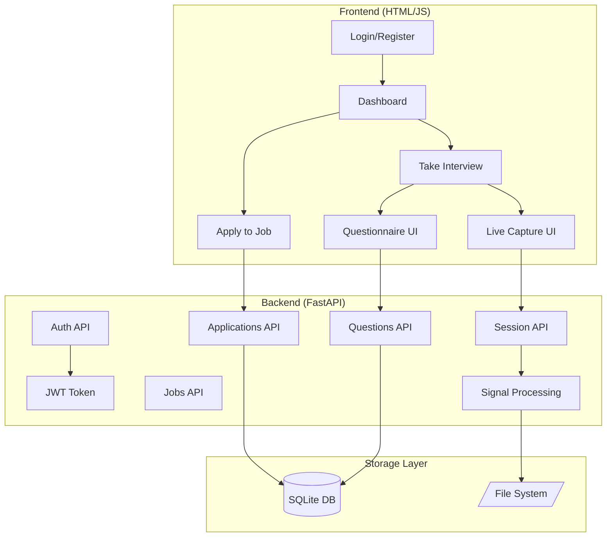
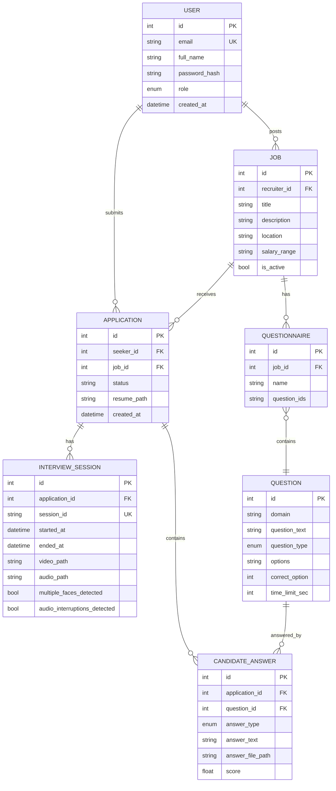

# AI Interview Signal Capture System
## Final Project Documentation - Technical Handover

**Version:** 1.0  
**Date:** 2026-01-31  
**Author:** Development Team

---

## Table of Contents
1. [Architecture & Design](#1-architecture--design)
2. [Data Sources & Schemas](#2-data-sources--schemas)
3. [Model Details (ML/CV)](#3-model-details-mlcv)
4. [Code Structure](#4-code-structure)
5. [APIs & Integrations](#5-apis--integrations)
6. [Deployment & Infrastructure](#6-deployment--infrastructure)
7. [Security & Compliance](#7-security--compliance)
8. [Operations, Monitoring & Rollback](#8-operations-monitoring--rollback)
9. [Known Limitations](#9-known-limitations)
10. [Future Roadmap](#10-future-roadmap)

---

## 1. Architecture & Design

### 1.1 System Overview



### 1.2 Design Principles

| Principle | Implementation |
|-----------|----------------|
| **Separation of Concerns** | API routes, business logic, and persistence are modular |
| **Role-Based Access** | Seekers, Recruiters, Admins with JWT enforcement |
| **Stateless API** | JWT tokens carry all session state |
| **Local-First** | Camera/audio processed on the server running locally |

### 1.3 Key Flows

#### Candidate Journey
1. Register as Seeker → Login → View Jobs → Apply (Upload Resume)
2. Resume auto-screened for keywords → Status: `Interview Required` or `Under Review`
3. Take Questionnaire (MCQ + Video + Audio + Text answers)
4. Answers stored → Recruiter reviews → Pass/Reject

#### Recruiter Journey
1. Login as Recruiter/Admin → View Job Pipeline
2. Review Resumes → Approve candidates for interview
3. Review Answers → Score video/audio → Pass to next stage

---

## 2. Data Sources & Schemas

### 2.1 Database: SQLite (via SQLModel)

**Location:** `backend/interview.db`

### 2.2 Schema Diagram



### 2.3 Enums

| Enum | Values |
|------|--------|
| `UserRole` | `seeker`, `recruiter`, `admin` |
| `QuestionType` | `mcq`, `video`, `audio`, `text` |

### 2.4 File Storage

| Path | Contents |
|------|----------|
| `backend/data/sessions/<id>/` | Video recordings (recording.mp4), audio, signals |
| `backend/data/answers/` | Video/audio answer files |
| `backend/uploads/` | Resume files (PDF, DOCX) |

---

## 3. Model Details (ML/CV)

### 3.1 MediaPipe Integration

| Module | Purpose | Model |
|--------|---------|-------|
| **Face Detection** | Detect faces in frame | MediaPipe Face Detection |
| **Face Mesh** | 468 facial landmarks | MediaPipe Face Mesh |
| **Pose Estimation** | Body posture tracking | MediaPipe Pose |

### 3.2 Signal Extraction

```python
# Signals captured per frame:
{
    "timestamp": 1706789000.123,
    "face_detected": true,
    "face_count": 1,
    "eye_aspect_ratio": 0.32,
    "gaze_direction": [0.1, -0.05],
    "head_pose": {"pitch": 5.2, "yaw": -3.1, "roll": 1.0},
    "blink_detected": false,
    "voice_activity": true
}
```

### 3.3 Integrity Checks

| Signal | Rule | Violation |
|--------|------|-----------|
| `face_count > 1` | Single person | `multiple_faces_detected` flag |
| Voice during silence | No background voices | `audio_interruptions_detected` flag |

---

## 4. Code Structure

```
interview-project/
├── backend/
│   ├── app/
│   │   ├── api/                    # API Routers
│   │   │   ├── auth.py             # Login, Register, JWT
│   │   │   ├── jobs.py             # Job CRUD
│   │   │   ├── applications.py     # Apply, Status updates
│   │   │   ├── questions.py        # Questionnaire, Answers
│   │   │   └── session.py          # Capture session management
│   │   ├── capture/                # CV Processing
│   │   │   ├── camera/             # Frame capture, face logging
│   │   │   └── audio/              # Audio capture, VAD
│   │   ├── core/
│   │   │   └── auth.py             # JWT encode/decode, hashing
│   │   ├── models/
│   │   │   └── schemas.py          # SQLModel definitions
│   │   ├── persistence/
│   │   │   ├── database.py         # SQLite engine
│   │   │   ├── repository.py       # Data access
│   │   │   └── seed_questions.py   # 30 default questions
│   │   ├── utils/
│   │   │   └── resume_parser.py    # PDF/DOCX text extraction
│   │   └── main.py                 # FastAPI app entry
│   ├── data/                       # Runtime data storage
│   ├── uploads/                    # Resume uploads
│   └── requirements.txt
├── frontend/
│   ├── pages/                      # HTML pages
│   │   ├── index.html              # Landing
│   │   ├── login.html / register.html
│   │   ├── dashboard.html          # Seeker dashboard
│   │   ├── admin.html              # Recruiter console
│   │   ├── apply.html              # Job application
│   │   ├── interview.html          # Questionnaire UI
│   │   ├── capture.html            # Live capture
│   │   ├── review_answers.html     # Recruiter answer review
│   │   ├── summary.html            # Session summary
│   │   └── replay.html             # Signal replay
│   └── scripts/                    # JavaScript modules
│       ├── session.js              # Session API calls
│       ├── signals.js              # WebSocket for signals
│       └── capture_v2.js           # MJPEG stream handling
└── doc/                            # Documentation
```

---

## 5. APIs & Integrations

### 5.1 REST API Endpoints

#### Authentication (`/api/auth`)
| Method | Endpoint | Description | Auth |
|--------|----------|-------------|------|
| POST | `/register` | Create user account | None |
| POST | `/login` | Get JWT token | None |
| GET | `/profile/{id}` | Get user profile | None |

#### Jobs (`/api/jobs`)
| Method | Endpoint | Description | Auth |
|--------|----------|-------------|------|
| GET | `/` | List active jobs | None |
| POST | `/` | Create job | Recruiter |
| GET | `/recruiter/{id}` | List recruiter's jobs | Recruiter |
| GET | `/{id}` | Get job details | None |

#### Applications (`/api/applications`)
| Method | Endpoint | Description | Auth |
|--------|----------|-------------|------|
| POST | `/apply` | Submit application | Seeker |
| GET | `/me` | List my applications | Seeker |
| GET | `/job/{id}` | List job applicants | Recruiter |
| PATCH | `/{id}/status` | Update status | Recruiter |
| GET | `/{id}/sessions` | Get interview sessions | Any |

#### Questions (`/api/questions`)
| Method | Endpoint | Description | Auth |
|--------|----------|-------------|------|
| GET | `/domains` | List question domains | Any |
| GET | `/job/{id}` | Get questionnaire | Any |
| POST | `/answer/text` | Submit MCQ/text | Seeker |
| POST | `/answer/media` | Upload video/audio | Seeker |
| GET | `/answers/{app_id}` | Get all answers | Recruiter |
| PATCH | `/answers/{id}/score` | Score answer | Recruiter |

#### Session (`/api/session`)
| Method | Endpoint | Description | Auth |
|--------|----------|-------------|------|
| POST | `/start` | Start capture | Seeker |
| POST | `/stop` | Stop capture | Seeker |
| POST | `/heartbeat` | Keep alive | Seeker |
| GET | `/summary` | Get signals summary | Any |

### 5.2 WebSocket

| Endpoint | Purpose |
|----------|---------|
| `/ws/live?candidate_id={id}` | Real-time signal streaming |

### 5.3 MJPEG Stream

| Endpoint | Purpose |
|----------|---------|
| `/api/video_feed?candidate_id={id}` | Live video frames |

---

## 6. Deployment & Infrastructure

### 6.1 Local Development

```bash
# Backend
cd backend
pip install -r requirements.txt
python -m uvicorn app.main:app --reload --host 0.0.0.0 --port 8000

# Seed questions
python -c "from app.persistence.seed_questions import seed_questions, seed_questionnaires; seed_questions(); seed_questionnaires()"
```

### 6.2 Production Considerations

| Aspect | Recommendation |
|--------|----------------|
| **Database** | Migrate to PostgreSQL for production |
| **File Storage** | Use S3/GCS for video/resume storage |
| **Video Capture** | Move to WebRTC for cloud deployment |
| **Load Balancing** | Use nginx reverse proxy |
| **HTTPS** | Required for camera/microphone access |

### 6.3 Docker (Future)

```dockerfile
FROM python:3.11-slim
WORKDIR /app
COPY backend/requirements.txt .
RUN pip install -r requirements.txt
COPY backend/ .
CMD ["uvicorn", "app.main:app", "--host", "0.0.0.0", "--port", "8000"]
```

---

## 7. Security & Compliance

### 7.1 Authentication

| Mechanism | Implementation |
|-----------|----------------|
| Password Hashing | PBKDF2-SHA256 via Passlib |
| Token Type | JWT (HS256) |
| Token Expiry | 24 hours |
| Token Storage | Client-side sessionStorage |

### 7.2 Authorization Matrix

| Resource | Seeker | Recruiter | Admin |
|----------|--------|-----------|-------|
| View Jobs | ✓ | ✓ | ✓ |
| Apply to Job | ✓ | ✗ | ✓ |
| Start Own Session | ✓ | ✗ | ✓ |
| View Own Answers | ✓ | ✗ | ✓ |
| View All Applications | ✗ | Own Jobs | ✓ |
| Score Answers | ✗ | Own Jobs | ✓ |
| Update Status | ✗ | Own Jobs | ✓ |

### 7.3 Data Protection

| Data Type | Protection |
|-----------|------------|
| Passwords | Never stored in plain text |
| Resumes | Stored on server filesystem |
| Video Recordings | Local storage only |
| PII | Minimal collection, no third-party sharing |

### 7.4 Compliance Checklist

- [ ] GDPR: Add data deletion endpoint
- [ ] CCPA: Add data export endpoint
- [ ] SOC 2: Implement audit logging

---

## 8. Operations, Monitoring & Rollback

### 8.1 Health Checks

| Endpoint | Purpose |
|----------|---------|
| `GET /` | Server alive check |
| `GET /api/jobs` | Database connectivity |

### 8.2 Logging

- Console logging via `print()` statements
- Errors logged with traceback
- **Recommendation:** Integrate structured logging (e.g., loguru, structlog)

### 8.3 Session Cleanup

| Feature | Implementation |
|---------|----------------|
| Heartbeat | Frontend sends pulse every 20 seconds |
| Timeout | Server cleans orphaned sessions after 60 seconds |
| Background Task | `session_cleanup_task()` runs every 10 seconds |

### 8.4 Rollback Strategy

1. **Database:** SQLite file can be replaced with backup
2. **Code:** Git-based rollback (`git revert` or `git checkout`)
3. **Config:** No external config files; environment variables

---

## 9. Known Limitations

| Category | Limitation | Impact | Workaround |
|----------|------------|--------|------------|
| **Video Capture** | Requires local camera | Cannot deploy to cloud | Use WebRTC in future |
| **Scalability** | Single-threaded capture | One candidate per server | Deploy multiple instances |
| **Database** | SQLite limitations | Not suitable for >100 concurrent users | Migrate to PostgreSQL |
| **PDF Parsing** | Requires PyMuPDF | Large dependency | Optional fallback to pdfplumber |
| **Browser Support** | Uses MediaRecorder API | Chrome/Firefox only | Safari has limited support |
| **No Email** | No email notifications | Users must check manually | Integrate email service |

---

## 10. Future Roadmap

### Phase 1: Cloud Deployment (Q2 2026)
- [ ] WebRTC-based video capture (client-side)
- [ ] PostgreSQL database migration
- [ ] S3 storage for video/audio files
- [ ] Docker containerization
- [ ] Kubernetes deployment

### Phase 2: Enhanced ML (Q3 2026)
- [ ] Emotion detection from facial expressions
- [ ] Voice sentiment analysis
- [ ] Cheating detection (eye tracking, tab switching)
- [ ] AI-powered answer scoring (LLM integration)

### Phase 3: Enterprise Features (Q4 2026)
- [ ] Multi-tenant architecture
- [ ] SSO integration (SAML/OIDC)
- [ ] Custom branding per organization
- [ ] Advanced analytics dashboard
- [ ] Audit logging and compliance reports

### Phase 4: Mobile (2027)
- [ ] React Native mobile app
- [ ] Offline-capable questionnaires
- [ ] Push notifications

---

## Appendix A: Environment Variables

| Variable | Default | Description |
|----------|---------|-------------|
| `SECRET_KEY` | (hardcoded) | JWT signing key |
| `DATABASE_URL` | `sqlite:///interview.db` | Database connection |

## Appendix B: Default Accounts

| Email | Password | Role |
|-------|----------|------|
| (none created) | - | Create via `/register` |

## Appendix C: Quick Commands

```bash
# Start server
cd backend && python -m uvicorn app.main:app --reload

# Seed database
python -c "from app.persistence.seed_questions import seed_questions, seed_questionnaires; seed_questions(); seed_questionnaires()"

# Access UI
open http://localhost:8000
```

---

**Document End**
