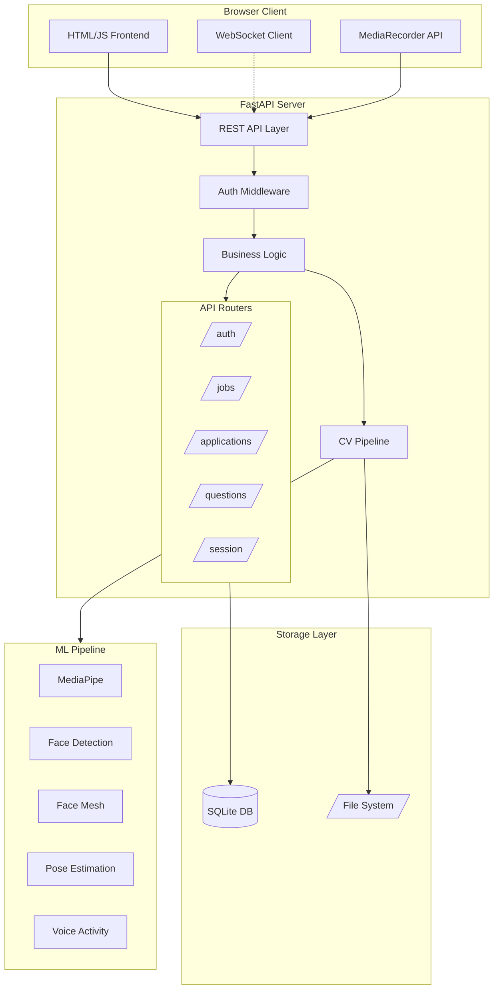
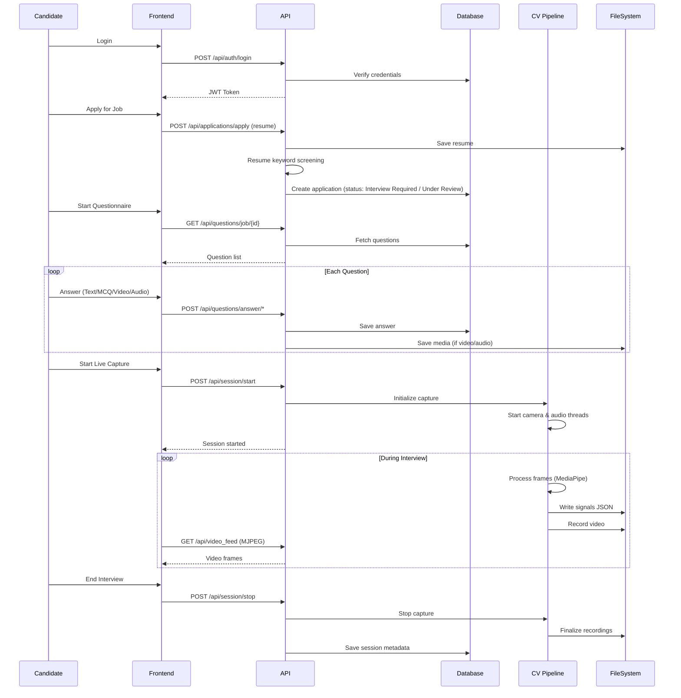
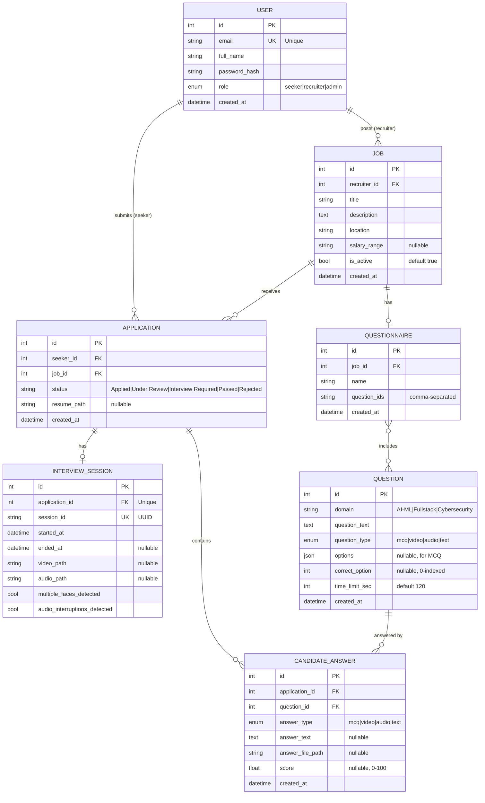
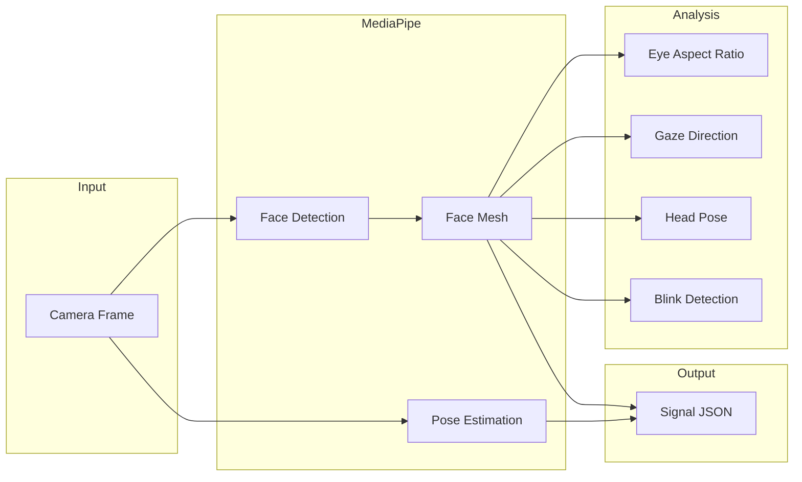

# AI Interview Signal Capture System
## Final Project Documentation - Technical Handover (Detailed Edition)

**Version:** 2.0  
**Date:** 2026-01-31  
**Author:** Development Team  
**Status:** Production Ready

---

## Table of Contents
1. [Executive Summary](#1-executive-summary)
2. [Architecture & Design](#2-architecture--design)
3. [Data Sources & Schemas](#3-data-sources--schemas)
4. [Model Details (ML/CV)](#4-model-details-mlcv)
5. [Code Structure](#5-code-structure)
6. [APIs & Integrations](#6-apis--integrations)
7. [Frontend Implementation](#7-frontend-implementation)
8. [Deployment & Infrastructure](#8-deployment--infrastructure)
9. [Security & Compliance](#9-security--compliance)
10. [Operations, Monitoring & Rollback](#10-operations-monitoring--rollback)
11. [Known Limitations](#11-known-limitations)
12. [Future Roadmap](#12-future-roadmap)
13. [Appendices](#13-appendices)

---

## 1. Executive Summary

### 1.1 Project Overview
The **AI Interview Signal Capture System** is a full-stack application designed to modernize the hiring process by combining traditional interview questionnaires with behavioral signal analysis. The system captures video, audio, and physiological signals during interviews to provide recruiters with objective data alongside subjective evaluations.

### 1.2 Key Capabilities

| Capability | Description |
|------------|-------------|
| **User Management** | Role-based system with Seekers (candidates), Recruiters, and Admins |
| **Job Board** | Recruiters post jobs; Seekers browse and apply |
| **Resume Screening** | Automated keyword extraction from PDF/DOCX with eligibility scoring |
| **Questionnaire System** | 30+ questions across AI-ML, Fullstack, Cybersecurity domains |
| **Live Capture** | Real-time video/audio recording with behavioral signal extraction |
| **Answer Review** | Recruiter interface for scoring video/audio responses |
| **Signal Replay** | Playback of recorded sessions with behavioral overlays |

### 1.3 Technology Stack

| Layer | Technology |
|-------|------------|
| **Backend** | Python 3.11, FastAPI, SQLModel, Uvicorn |
| **Frontend** | HTML5, JavaScript (Vanilla), TailwindCSS (CDN) |
| **Database** | SQLite (development), PostgreSQL-ready |
| **ML/CV** | MediaPipe (Face Detection, Face Mesh, Pose) |
| **Auth** | JWT (HS256), Passlib (PBKDF2-SHA256) |
| **File Parsing** | PyMuPDF, python-docx |

---

## 2. Architecture & Design

### 2.1 High-Level System Architecture



### 2.2 Component Interaction Diagram



### 2.3 Design Patterns Used

| Pattern | Implementation | Location |
|---------|----------------|----------|
| **Repository Pattern** | Data access abstracted from business logic | `persistence/repository.py` |
| **Dependency Injection** | FastAPI's `Depends()` for DB sessions, auth | All API routers |
| **Observer Pattern** | Frame callbacks in CameraCapture | `capture/camera/camera_capture.py` |
| **Singleton (per-candidate)** | Session registry keyed by candidate_id | `api/session.py` |
| **Factory Pattern** | Session creation with `create_session()` | `api/session.py` |

### 2.4 Thread Safety Model

The capture system uses multiple threads:

```
Main Thread (Uvicorn)
├── API Request Handlers
└── WebSocket Handlers

CameraCapture Thread
├── Frame acquisition
├── MediaPipe processing
└── Frame callback execution

AudioCapture Thread
├── Audio buffer filling
├── VAD processing
└── Audio callback execution
```

**Synchronization Mechanisms:**
- `threading.Lock()` for signal state access
- `threading.Event()` for start/stop coordination
- Thread-safe queues for inter-thread communication

---

## 3. Data Sources & Schemas

### 3.1 Database Configuration

```python
# backend/app/persistence/database.py
DATABASE_URL = "sqlite:///./interview.db"

engine = create_engine(
    DATABASE_URL, 
    connect_args={"check_same_thread": False}  # Required for SQLite
)
```

### 3.2 Complete Schema Definitions

#### User Model
```python
class UserRole(str, Enum):
    RECRUITER = "recruiter"
    SEEKER = "seeker"
    ADMIN = "admin"

class User(SQLModel, table=True):
    id: Optional[int] = Field(default=None, primary_key=True)
    email: str = Field(index=True, unique=True)  # Unique constraint
    full_name: str
    password_hash: str  # PBKDF2-SHA256 hashed
    role: UserRole = UserRole.SEEKER
    created_at: datetime = Field(default_factory=datetime.utcnow)
    
    # Relationships
    jobs: List["Job"] = Relationship(back_populates="recruiter")
    applications: List["Application"] = Relationship(back_populates="seeker")
```

#### Job Model
```python
class Job(SQLModel, table=True):
    id: Optional[int] = Field(default=None, primary_key=True)
    recruiter_id: int = Field(foreign_key="user.id")
    title: str                    # e.g., "Senior AI Engineer"
    description: str              # Full job description
    location: str                 # e.g., "Remote", "New York, NY"
    salary_range: Optional[str]   # e.g., "$120k - $150k"
    is_active: bool = True        # Soft delete flag
    created_at: datetime = Field(default_factory=datetime.utcnow)
    
    # Relationships
    recruiter: User = Relationship(back_populates="jobs")
    applications: List["Application"] = Relationship(back_populates="job")
```

#### Application Model
```python
class Application(SQLModel, table=True):
    id: Optional[int] = Field(default=None, primary_key=True)
    seeker_id: int = Field(foreign_key="user.id")
    job_id: int = Field(foreign_key="job.id")
    status: str = Field(default="Applied")
    # Status Values: "Applied", "Under Review", "Interview Required", 
    #                "Interviewed", "Passed", "Rejected", "Offered"
    resume_path: Optional[str] = None  # Path to uploaded resume
    created_at: datetime = Field(default_factory=datetime.utcnow)
    
    # Relationships
    seeker: User = Relationship(back_populates="applications")
    job: Job = Relationship(back_populates="applications")
    interview_session: Optional["InterviewSession"] = Relationship(...)
```

#### Interview Session Model
```python
class InterviewSession(SQLModel, table=True):
    id: Optional[int] = Field(default=None, primary_key=True)
    application_id: int = Field(foreign_key="application.id")
    session_id: str = Field(index=True, unique=True)  # UUID
    started_at: datetime = Field(default_factory=datetime.utcnow)
    ended_at: Optional[datetime] = None
    video_path: Optional[str] = None      # Path to recording.mp4
    audio_path: Optional[str] = None      # Path to audio.wav
    multiple_faces_detected: bool = False  # Integrity flag
    audio_interruptions_detected: bool = False  # Integrity flag
    
    # Relationships
    application: Application = Relationship(back_populates="interview_session")
```

#### Question Model
```python
class QuestionType(str, Enum):
    MCQ = "mcq"      # Multiple choice
    VIDEO = "video"  # Video response
    AUDIO = "audio"  # Audio response
    TEXT = "text"    # Written response

class Question(SQLModel, table=True):
    id: Optional[int] = Field(default=None, primary_key=True)
    domain: str                   # "AI-ML", "Fullstack", "Cybersecurity"
    question_text: str            # The question itself
    question_type: QuestionType
    options: Optional[str] = None  # JSON: ["Option A", "Option B", ...]
    correct_option: Optional[int] = None  # 0-based index for MCQ
    time_limit_sec: int = 120     # Default 2 minutes
    created_at: datetime = Field(default_factory=datetime.utcnow)
```

#### Questionnaire Model
```python
class Questionnaire(SQLModel, table=True):
    id: Optional[int] = Field(default=None, primary_key=True)
    job_id: int = Field(foreign_key="job.id")
    name: str = "Default Questionnaire"
    question_ids: str  # Comma-separated: "1,2,3,4,5,6,7,8,9,10"
    created_at: datetime = Field(default_factory=datetime.utcnow)
```

#### Candidate Answer Model
```python
class CandidateAnswer(SQLModel, table=True):
    id: Optional[int] = Field(default=None, primary_key=True)
    application_id: int = Field(foreign_key="application.id")
    question_id: int = Field(foreign_key="question.id")
    answer_type: QuestionType
    answer_text: Optional[str] = None      # MCQ index or text content
    answer_file_path: Optional[str] = None  # Path for video/audio
    score: Optional[float] = None          # 0-100, set by system or recruiter
    created_at: datetime = Field(default_factory=datetime.utcnow)
```

### 3.3 Entity Relationship Diagram



### 3.4 File Storage Structure

```
backend/
├── data/
│   ├── sessions/
│   │   └── {candidate_id}_{timestamp}/
│   │       ├── recording.mp4        # Full video recording
│   │       ├── audio.wav            # Audio track
│   │       ├── signals.json         # Frame-by-frame signals
│   │       └── summary.json         # Session summary
│   └── answers/
│       └── answer_{app_id}_{question_id}.webm
├── uploads/
│   └── resume_{seeker_id}_{job_id}.pdf
└── interview.db
```

### 3.5 Seed Data

The system comes pre-loaded with 30 questions:

| Domain | MCQ | Video | Audio | Text | Total |
|--------|-----|-------|-------|------|-------|
| AI-ML | 4 | 3 | 2 | 1 | 10 |
| Fullstack | 4 | 3 | 2 | 1 | 10 |
| Cybersecurity | 4 | 3 | 2 | 1 | 10 |

**Sample Questions:**

**AI-ML MCQ:**
> "Which of the following is NOT a type of machine learning?"
> A) Supervised Learning, B) Unsupervised Learning, C) Deterministic Learning, D) Reinforcement Learning
> *Correct: C (index 2)*

**Fullstack Video:**
> "Walk me through how you would design a REST API for a social media application. Consider authentication, rate limiting, and scalability." *(3 min)*

**Cybersecurity Audio:**
> "Explain the CIA triad and give an example of how each component could be compromised in a typical web application." *(2 min)*

---

## 4. Model Details (ML/CV)

### 4.1 MediaPipe Pipeline

The system uses Google's MediaPipe for real-time face and pose analysis:



### 4.2 Signal Extraction Details

#### Eye Aspect Ratio (EAR)
Measures eye openness to detect blinks and drowsiness:

```python
def calculate_ear(eye_landmarks):
    """
    EAR = (||p2-p6|| + ||p3-p5||) / (2 * ||p1-p4||)
    
    p1, p4 = horizontal points (corners)
    p2, p6 = upper lid points
    p3, p5 = lower lid points
    """
    vertical_1 = distance(p2, p6)
    vertical_2 = distance(p3, p5)
    horizontal = distance(p1, p4)
    return (vertical_1 + vertical_2) / (2.0 * horizontal)
```

**Thresholds:**
- EAR > 0.25: Eyes open
- EAR < 0.20: Blink detected
- EAR < 0.15 for >2s: Drowsiness warning

#### Head Pose Estimation
Calculates pitch, yaw, and roll:

```python
def estimate_head_pose(landmarks):
    """
    Uses 6 key facial points:
    - Nose tip, Chin, Left/Right eye corners, Left/Right mouth corners
    
    Applies solvePnP to estimate rotation vector
    """
    # Model points (3D reference)
    model_points = np.array([
        (0.0, 0.0, 0.0),      # Nose tip
        (0.0, -63.6, -12.5),  # Chin
        (-43.3, 32.7, -26.0), # Left eye corner
        (43.3, 32.7, -26.0),  # Right eye corner
        (-28.9, -28.9, -24.1),# Left mouth corner
        (28.9, -28.9, -24.1)  # Right mouth corner
    ])
    
    success, rotation_vec, translation_vec = cv2.solvePnP(...)
    return pitch, yaw, roll
```

**Interpretation:**
| Metric | Normal Range | Warning Threshold |
|--------|--------------|-------------------|
| Pitch | -15° to +15° | > ±30° (looking away) |
| Yaw | -20° to +20° | > ±45° (turning head) |
| Roll | -10° to +10° | > ±20° (tilting) |

#### Face Count Detection
Integrity check for multiple persons:

```python
def detect_faces(frame):
    """Returns number of faces in frame."""
    results = face_detection.process(cv2.cvtColor(frame, cv2.COLOR_BGR2RGB))
    return len(results.detections) if results.detections else 0
```

### 4.3 Voice Activity Detection (VAD)

```python
class VoiceActivityDetector:
    """Simple energy-based VAD."""
    
    def __init__(self, threshold=0.02, sample_rate=44100):
        self.threshold = threshold
        self.sample_rate = sample_rate
    
    def is_speaking(self, audio_chunk):
        """
        Calculate RMS energy and compare to threshold.
        """
        rms = np.sqrt(np.mean(audio_chunk ** 2))
        return rms > self.threshold
```

### 4.4 Signal Output Format

Each frame generates a signal record:

```json
{
    "timestamp": 1706789000.123,
    "frame_number": 1234,
    "face": {
        "detected": true,
        "count": 1,
        "confidence": 0.98,
        "bounding_box": [120, 80, 280, 320]
    },
    "eyes": {
        "left_ear": 0.28,
        "right_ear": 0.27,
        "average_ear": 0.275,
        "blink_detected": false
    },
    "gaze": {
        "direction": [0.05, -0.02],
        "looking_away": false
    },
    "head_pose": {
        "pitch": 3.2,
        "yaw": -5.1,
        "roll": 0.8
    },
    "audio": {
        "voice_activity": true,
        "rms_energy": 0.045
    },
    "integrity": {
        "multiple_faces": false,
        "audio_interruption": false
    }
}
```

---

## 5. Code Structure

### 5.1 Complete Directory Tree

```
interview-project/
├── .agent/                          # Workflow configurations
│   └── workflows/
├── .git/                            # Git repository
├── .gitignore                       # Git ignore rules
│
├── backend/                         # Python Backend
│   ├── app/
│   │   ├── __init__.py
│   │   ├── main.py                  # FastAPI application entry point
│   │   ├── cli.py                   # Command-line interface tools
│   │   │
│   │   ├── api/                     # API Route Definitions
│   │   │   ├── __init__.py
│   │   │   ├── auth.py              # Authentication endpoints
│   │   │   ├── jobs.py              # Job CRUD operations
│   │   │   ├── applications.py      # Application management
│   │   │   ├── questions.py         # Questionnaire & answers
│   │   │   └── session.py           # Capture session management
│   │   │
│   │   ├── capture/                 # Computer Vision Pipeline
│   │   │   ├── __init__.py
│   │   │   ├── camera/
│   │   │   │   ├── __init__.py
│   │   │   │   ├── camera_capture.py   # Camera frame acquisition
│   │   │   │   ├── eye_tracking.py     # EAR calculation
│   │   │   │   ├── face_logger.py      # Face detection logging
│   │   │   │   └── head_movement.py    # Head pose estimation
│   │   │   └── audio/
│   │   │       ├── __init__.py
│   │   │       ├── audio_capture.py    # Microphone capture
│   │   │       └── voice_activity.py   # VAD implementation
│   │   │
│   │   ├── core/                    # Core Utilities
│   │   │   └── auth.py              # JWT encoding/decoding, password hashing
│   │   │
│   │   ├── models/                  # Data Models
│   │   │   └── schemas.py           # SQLModel definitions (13 models)
│   │   │
│   │   ├── persistence/             # Database Layer
│   │   │   ├── __init__.py
│   │   │   ├── database.py          # SQLite engine configuration
│   │   │   ├── repository.py        # CRUD operations
│   │   │   └── seed_questions.py    # Question bank seeding
│   │   │
│   │   ├── session/                 # (Legacy session code)
│   │   │
│   │   ├── ui/                      # (Terminal UI utilities)
│   │   │
│   │   └── utils/                   # Utility Functions
│   │       └── resume_parser.py     # PDF/DOCX text extraction
│   │
│   ├── data/                        # Runtime Data (gitignored)
│   │   ├── sessions/                # Interview recordings
│   │   └── answers/                 # Media answers
│   │
│   ├── uploads/                     # Uploaded Files (gitignored)
│   │   └── *.pdf, *.docx           # Resumes
│   │
│   ├── requirements.txt             # Python dependencies
│   └── interview.db                 # SQLite database (gitignored)
│
├── frontend/                        # Static Frontend
│   ├── pages/                       # HTML Pages
│   │   ├── index.html               # Landing page
│   │   ├── login.html               # User login
│   │   ├── register.html            # User registration
│   │   ├── dashboard.html           # Seeker dashboard
│   │   ├── admin.html               # Recruiter admin console
│   │   ├── jobs.html                # Job listings
│   │   ├── apply.html               # Job application form
│   │   ├── interview.html           # Questionnaire interface
│   │   ├── capture.html             # Live capture interface
│   │   ├── summary.html             # Session summary
│   │   ├── replay.html              # Signal replay player
│   │   └── review_answers.html      # Recruiter answer review
│   │
│   ├── scripts/                     # JavaScript Modules
│   │   ├── session.js               # Session API helpers
│   │   ├── signals.js               # WebSocket signal handling
│   │   └── capture_v2.js            # MJPEG stream handling
│   │
│   └── assets/                      # Static Assets
│
├── doc/                             # Documentation
│   ├── TECHNICAL_HANDOVER.md        # This document
│   └── ...
│
├── ui/                              # (Legacy UI components)
│
└── test_mediapipe*.py               # MediaPipe test scripts
```

### 5.2 Key Module Descriptions

#### `main.py` - Application Entry Point
- Configures FastAPI app with CORS
- Mounts static file directories
- Registers all API routers
- Implements page routes (HTML serving)
- Defines WebSocket and MJPEG endpoints
- Runs background session cleanup task

#### `api/auth.py` - Authentication
- `POST /register` - Create new user account
- `POST /login` - Authenticate and return JWT
- `GET /profile/{id}` - Fetch user profile
- `get_current_user()` - Dependency for JWT validation
- `get_admin_user()` - Dependency requiring admin role
- `get_recruiter_user()` - Dependency requiring recruiter/admin

#### `api/session.py` - Capture Session
- `CaptureSession` class - Main session orchestrator
- Manages camera and audio capture threads
- Thread-safe signal state with locking
- Heartbeat tracking for session liveness
- Video recording lifecycle management

#### `api/questions.py` - Questionnaire API
- Domain listing and job-specific questionnaire fetch
- Text/MCQ answer submission with auto-scoring
- Video/audio file upload handling
- Recruiter answer retrieval and scoring

#### `utils/resume_parser.py` - Resume Processing
- PDF text extraction (PyMuPDF)
- DOCX text extraction (python-docx)
- Domain-specific keyword sets
- Eligibility scoring algorithm

---

## 6. APIs & Integrations

### 6.1 REST API Reference

#### Authentication API (`/api/auth`)

##### Register User
```http
POST /api/auth/register
Content-Type: application/json

{
    "email": "candidate@example.com",
    "password": "securepass123",
    "full_name": "John Doe",
    "role": "seeker"
}
```

**Response:**
```json
{
    "id": 1,
    "email": "candidate@example.com",
    "full_name": "John Doe",
    "role": "seeker",
    "created_at": "2026-01-31T12:00:00"
}
```

##### Login
```http
POST /api/auth/login
Content-Type: application/x-www-form-urlencoded

username=candidate@example.com&password=securepass123
```

**Response:**
```json
{
    "access_token": "eyJhbGciOiJIUzI1NiIs...",
    "token_type": "bearer"
}
```

#### Jobs API (`/api/jobs`)

##### List Active Jobs
```http
GET /api/jobs
```

**Response:**
```json
[
    {
        "id": 1,
        "title": "Senior AI Engineer",
        "description": "Join our ML team...",
        "location": "Remote",
        "salary_range": "$150k - $200k",
        "is_active": true,
        "recruiter_id": 2,
        "created_at": "2026-01-15T10:00:00"
    }
]
```

##### Create Job (Recruiter Only)
```http
POST /api/jobs
Authorization: Bearer {token}
Content-Type: application/json

{
    "title": "Backend Developer",
    "description": "Build scalable APIs...",
    "location": "New York, NY",
    "salary_range": "$120k - $150k"
}
```

#### Applications API (`/api/applications`)

##### Apply for Job
```http
POST /api/applications/apply
Authorization: Bearer {token}
Content-Type: multipart/form-data

job_id=1
seeker_id=3
resume=@resume.pdf
```

**Response:**
```json
{
    "id": 1,
    "job_id": 1,
    "seeker_id": 3,
    "status": "Interview Required",  // or "Under Review"
    "resume_path": "uploads/resume_3_1.pdf",
    "created_at": "2026-01-31T14:00:00"
}
```

##### Update Application Status (Recruiter)
```http
PATCH /api/applications/{id}/status
Authorization: Bearer {token}
Content-Type: application/json

{
    "status": "Passed"
}
```

#### Questions API (`/api/questions`)

##### Get Questionnaire for Job
```http
GET /api/questions/job/1
Authorization: Bearer {token}
```

**Response:**
```json
[
    {
        "id": 1,
        "domain": "AI-ML",
        "question_text": "Which activation function...",
        "question_type": "mcq",
        "options": ["ReLU", "Sigmoid", "Tanh", "Softmax"],
        "time_limit_sec": 60
    },
    {
        "id": 5,
        "domain": "AI-ML",
        "question_text": "Explain gradient descent...",
        "question_type": "video",
        "time_limit_sec": 180
    }
]
```

##### Submit MCQ/Text Answer
```http
POST /api/questions/answer/text
Authorization: Bearer {token}
Content-Type: application/json

{
    "application_id": 1,
    "question_id": 1,
    "answer_text": "2"  // 0-indexed option selection
}
```

**Response (MCQ with auto-scoring):**
```json
{
    "status": "saved",
    "score": 100.0  // or 0.0 if incorrect
}
```

##### Submit Video/Audio Answer
```http
POST /api/questions/answer/media
Authorization: Bearer {token}
Content-Type: multipart/form-data

application_id=1
question_id=5
media_file=@answer.webm
```

##### Get Answers for Application (Recruiter)
```http
GET /api/questions/answers/1
Authorization: Bearer {token}
```

##### Score an Answer (Recruiter)
```http
PATCH /api/questions/answers/1/score?score=85
Authorization: Bearer {token}
```

#### Session API (`/api/session`)

##### Start Capture Session
```http
POST /api/session/start
Authorization: Bearer {token}
Content-Type: application/json

{
    "candidate_id": "john_doe_123",
    "application_id": 1
}
```

##### Stop Capture Session
```http
POST /api/session/stop
Authorization: Bearer {token}
Content-Type: application/json

{
    "candidate_id": "john_doe_123"
}
```

##### Heartbeat (Keep Alive)
```http
POST /api/session/heartbeat
Authorization: Bearer {token}
Content-Type: application/json

{
    "candidate_id": "john_doe_123"
}
```

### 6.2 WebSocket API

```javascript
// Connect to live signal stream
const ws = new WebSocket(`ws://localhost:8000/ws/live?candidate_id=${id}`);

ws.onmessage = (event) => {
    const signals = JSON.parse(event.data);
    // {
    //     "face_detected": true,
    //     "face_count": 1,
    //     "eye_aspect_ratio": 0.28,
    //     "head_pose": {"pitch": 3.2, "yaw": -1.5, "roll": 0.5},
    //     "voice_activity": true,
    //     ...
    // }
};
```

### 6.3 MJPEG Video Stream

```html
<!-- Embed live video feed -->

```

**Technical Details:**
- Content-Type: `multipart/x-mixed-replace; boundary=frame`
- Frame format: JPEG with quality ~50%
- Typical frame rate: 15-30 FPS

---

## 7. Frontend Implementation

### 7.1 Page Overview

| Page | Purpose | Key Features |
|------|---------|--------------|
| `index.html` | Landing | Hero, feature highlights, CTA |
| `login.html` | Authentication | Email/password, JWT storage |
| `register.html` | Registration | Role selection (seeker/recruiter) |
| `dashboard.html` | Seeker home | Applications list, interview buttons |
| `admin.html` | Recruiter console | Job management, candidate pipeline |
| `jobs.html` | Job listings | Browse and apply |
| `apply.html` | Application form | Resume upload |
| `interview.html` | Questionnaire | MCQ, video/audio recording |
| `capture.html` | Live capture | MJPEG feed, signal display |
| `summary.html` | Session results | Signal summary, integrity flags |
| `replay.html` | Playback | Video with signal overlay |
| `review_answers.html` | Recruiter review | Answer playback, scoring |

### 7.2 JavaScript Architecture

**Session Storage:**
```javascript
// On login success
sessionStorage.setItem('token', response.access_token);
sessionStorage.setItem('user', JSON.stringify(user));

// API calls
const headers = {
    'Authorization': `Bearer ${sessionStorage.getItem('token')}`,
    'Content-Type': 'application/json'
};
```

**Session Management (session.js):**
```javascript
// Start session
async function startSession(candidateId, applicationId) {
    const res = await fetch('/api/session/start', {
        method: 'POST',
        headers: { 'Authorization': `Bearer ${token}` },
        body: JSON.stringify({ candidate_id: candidateId, application_id: applicationId })
    });
    return res.json();
}

// Heartbeat
let heartbeatInterval;
function startHeartbeat(candidateId) {
    heartbeatInterval = setInterval(() => {
        fetch('/api/session/heartbeat', {
            method: 'POST',
            headers: { 'Authorization': `Bearer ${token}` },
            body: JSON.stringify({ candidate_id: candidateId })
        });
    }, 20000); // Every 20 seconds
}
```

**Media Recording (interview.html):**
```javascript
async function startRecording() {
    const stream = await navigator.mediaDevices.getUserMedia({ video: true, audio: true });
    mediaRecorder = new MediaRecorder(stream);
    
    mediaRecorder.ondataavailable = (e) => recordedChunks.push(e.data);
    mediaRecorder.onstop = () => uploadAnswer();
    
    mediaRecorder.start();
}

async function uploadAnswer() {
    const blob = new Blob(recordedChunks, { type: 'video/webm' });
    const formData = new FormData();
    formData.append('media_file', blob, `answer_${questionId}.webm`);
    formData.append('application_id', applicationId);
    formData.append('question_id', questionId);
    
    await fetch('/api/questions/answer/media', {
        method: 'POST',
        headers: { 'Authorization': `Bearer ${token}` },
        body: formData
    });
}
```

### 7.3 Styling

- **Framework:** TailwindCSS (CDN)
- **Theme:** Minimalist black/white with sharp edges (no border-radius)
- **Typography:** Inter (sans-serif), IBM Plex Mono (monospace)
- **Icons:** Material Symbols Outlined

---

## 8. Deployment & Infrastructure

### 8.1 Development Environment Setup

```bash
# 1. Clone repository
git clone <repo-url>
cd interview-project

# 2. Create virtual environment
python -m venv venv
source venv/bin/activate  # Linux/Mac
# or
.\venv\Scripts\activate   # Windows

# 3. Install dependencies
cd backend
pip install -r requirements.txt

# 4. Initialize database
python -c "from app.persistence.database import init_db; init_db()"

# 5. Seed questions
python -c "from app.persistence.seed_questions import seed_questions, seed_questionnaires; seed_questions(); seed_questionnaires()"

# 6. Start server
python -m uvicorn app.main:app --reload --host 0.0.0.0 --port 8000

# 7. Access application
# Open http://localhost:8000 in browser
```

### 8.2 Production Deployment Guide

#### Option A: Bare Metal / VM

```bash
# 1. System dependencies
sudo apt update
sudo apt install python3.11 python3.11-venv nginx

# 2. Application setup
cd /opt
git clone <repo-url> interview-system
cd interview-system/backend
python3.11 -m venv venv
source venv/bin/activate
pip install -r requirements.txt
pip install gunicorn

# 3. Systemd service
sudo nano /etc/systemd/system/interview.service
```

```ini
[Unit]
Description=AI Interview System
After=network.target

[Service]
User=www-data
Group=www-data
WorkingDirectory=/opt/interview-system/backend
Environment="PATH=/opt/interview-system/backend/venv/bin"
ExecStart=/opt/interview-system/backend/venv/bin/uvicorn app.main:app --host 127.0.0.1 --port 8000

[Install]
WantedBy=multi-user.target
```

```bash
# 4. Nginx reverse proxy
sudo nano /etc/nginx/sites-available/interview
```

```nginx
server {
    listen 80;
    server_name interview.example.com;
    
    location / {
        proxy_pass http://127.0.0.1:8000;
        proxy_http_version 1.1;
        proxy_set_header Upgrade $http_upgrade;
        proxy_set_header Connection "upgrade";
        proxy_set_header Host $host;
        proxy_set_header X-Real-IP $remote_addr;
    }
    
    client_max_body_size 100M;  # For video uploads
}
```

```bash
# 5. Enable and start
sudo systemctl enable interview
sudo systemctl start interview
sudo systemctl reload nginx
```

#### Option B: Docker

**Dockerfile:**
```dockerfile
FROM python:3.11-slim

# Install system dependencies for OpenCV
RUN apt-get update && apt-get install -y \
    libgl1-mesa-glx \
    libglib2.0-0 \
    && rm -rf /var/lib/apt/lists/*

WORKDIR /app

COPY backend/requirements.txt .
RUN pip install --no-cache-dir -r requirements.txt

COPY backend/ ./backend/
COPY frontend/ ./frontend/

WORKDIR /app/backend

EXPOSE 8000

CMD ["uvicorn", "app.main:app", "--host", "0.0.0.0", "--port", "8000"]
```

**docker-compose.yml:**
```yaml
version: '3.8'

services:
  app:
    build: .
    ports:
      - "8000:8000"
    volumes:
      - ./backend/data:/app/backend/data
      - ./backend/uploads:/app/backend/uploads
    environment:
      - SECRET_KEY=${SECRET_KEY:-your-production-secret}
    restart: unless-stopped

  # Optional: PostgreSQL for production
  db:
    image: postgres:15
    environment:
      POSTGRES_USER: interview
      POSTGRES_PASSWORD: ${DB_PASSWORD}
      POSTGRES_DB: interview
    volumes:
      - pgdata:/var/lib/postgresql/data

volumes:
  pgdata:
```

### 8.3 Environment Variables

| Variable | Default | Description |
|----------|---------|-------------|
| `SECRET_KEY` | (hardcoded) | JWT signing secret (CHANGE IN PROD) |
| `DATABASE_URL` | `sqlite:///./interview.db` | Database connection string |
| `UPLOAD_MAX_SIZE` | 100MB | Maximum file upload size |

### 8.4 SSL/TLS Configuration

**Required** for camera/microphone access in browsers (getUserMedia):

```bash
# Let's Encrypt with Certbot
sudo apt install certbot python3-certbot-nginx
sudo certbot --nginx -d interview.example.com
```

---

## 9. Security & Compliance

### 9.1 Authentication Implementation

**Password Hashing:**
```python
from passlib.hash import pbkdf2_sha256

# Hash password
hash = pbkdf2_sha256.hash(password)

# Verify password
valid = pbkdf2_sha256.verify(password, hash)
```

**JWT Token Structure:**
```json
{
    "sub": "user@example.com",    // Subject (user identifier)
    "role": "seeker",             // User role
    "exp": 1706961600             // Expiration timestamp
}
```

**Token Lifecycle:**
- Issued on successful login
- Expires after 24 hours
- No refresh token mechanism (re-login required)
- Stored in browser sessionStorage

### 9.2 Authorization Matrix

| Endpoint | Seeker | Recruiter | Admin | Notes |
|----------|--------|-----------|-------|-------|
| `GET /api/jobs` | ✓ | ✓ | ✓ | Public |
| `POST /api/jobs` | ✗ | ✓ | ✓ | Create job |
| `POST /api/applications/apply` | ✓ | ✗ | ✓ | Apply only |
| `GET /api/applications/me` | Own | ✗ | All | Own apps |
| `GET /api/applications/job/{id}` | ✗ | Own Jobs | ✓ | Recruiter sees own job apps |
| `PATCH /api/applications/{id}/status` | ✗ | Own Jobs | ✓ | Update status |
| `POST /api/session/start` | ✓ | ✗ | ✓ | Own sessions |
| `GET /api/questions/answers/{app_id}` | ✗ | Own Jobs | ✓ | View answers |
| `PATCH /api/questions/answers/{id}/score` | ✗ | ✓ | ✓ | Score answers |

### 9.3 Security Checklist

- [x] Password hashing (PBKDF2-SHA256)
- [x] JWT authentication
- [x] Role-based access control
- [x] SQL injection prevention (SQLModel/SQLAlchemy)
- [x] CORS configuration
- [ ] Rate limiting (TODO)
- [ ] Input validation with Pydantic
- [ ] HTTPS enforcement (requires deployment config)
- [ ] CSRF protection (not needed for API-only)

### 9.4 Data Protection

| Data Category | Storage | Encryption | Retention |
|---------------|---------|------------|-----------|
| Passwords | Database | Hashed (irreversible) | Permanent |
| JWT Tokens | Client-side | None (signed) | 24 hours |
| Resumes | Filesystem | None | Until deletion |
| Video Recordings | Filesystem | None | Configurable |
| Signals | Filesystem (JSON) | None | With session |

### 9.5 Compliance Considerations

**GDPR:**
- [ ] Right to access: Implement data export endpoint
- [ ] Right to erasure: Implement data deletion endpoint
- [ ] Consent management: Add consent tracking
- [ ] Data minimization: Review collected fields

**Video Recording Consent:**
- Implicit consent assumed when starting interview
- Recommend: Add explicit consent checkbox before capture

---

## 10. Operations, Monitoring & Rollback

### 10.1 Health Monitoring

**Endpoint Health:**
```bash
# Basic health check
curl http://localhost:8000/

# Database connectivity
curl http://localhost:8000/api/jobs
```

**Recommended Monitoring Stack:**
- Prometheus + Grafana for metrics
- Sentry for error tracking
- Loki for log aggregation

### 10.2 Logging

Current logging is via `print()` statements. Recommended upgrade:

```python
import logging
from loguru import logger

# Configure
logger.add("logs/app.log", rotation="10 MB", retention="7 days")

# Usage
logger.info("Session started", candidate_id=cid)
logger.error("Failed to process frame", exc_info=True)
```

### 10.3 Session Cleanup

**Background Task:**
```python
# In main.py startup
async def session_cleanup_task():
    """Clean up abandoned sessions every 10 seconds."""
    while True:
        now = time.time()
        for cid, session in list(_active_sessions.items()):
            if session.last_seen and (now - session.last_seen) > 60:
                logger.warning(f"Cleaning orphaned session: {cid}")
                session.stop()
                clear_session(cid)
        await asyncio.sleep(10)
```

### 10.4 Backup Strategy

**Database:**
```bash
# Manual backup
cp backend/interview.db backend/backups/interview_$(date +%Y%m%d).db

# Automated (cron)
0 0 * * * cp /opt/interview/backend/interview.db /backups/interview_$(date +\%Y\%m\%d).db
```

**File Storage:**
```bash
# Sync to backup location
rsync -av backend/data/ /backups/data/
rsync -av backend/uploads/ /backups/uploads/
```

### 10.5 Rollback Procedures

**Code Rollback:**
```bash
# View recent commits
git log --oneline -10

# Rollback to previous commit
git checkout <commit-hash>

# Or revert a specific commit
git revert <commit-hash>

# Restart service
sudo systemctl restart interview
```

**Database Rollback:**
```bash
# Stop service
sudo systemctl stop interview

# Restore backup
cp /backups/interview_20260130.db backend/interview.db

# Start service
sudo systemctl start interview
```

---

## 11. Known Limitations

### 11.1 Technical Limitations

| ID | Category | Limitation | Impact | Mitigation |
|----|----------|------------|--------|------------|
| L1 | Video | Requires local camera access | Cannot deploy to cloud with live capture | Use WebRTC for cloud |
| L2 | Scale | Single-threaded capture | One candidate per server instance | Deploy multiple instances |
| L3 | Database | SQLite file locking | Limited concurrent writes | Migrate to PostgreSQL |
| L4 | MediaPipe | CPU-intensive processing | High CPU on low-end devices | Reduce processing FPS |
| L5 | Browser | MediaRecorder compatibility | Safari has limited WebM support | Transcode on server |
| L6 | Storage | Local filesystem only | Not suitable for distributed deployment | Use S3/GCS |

### 11.2 Feature Limitations

| ID | Feature | Limitation | Workaround |
|----|---------|------------|------------|
| F1 | Notifications | No email notifications | Manual status checking |
| F2 | Scheduling | No interview scheduling | External calendar integration |
| F3 | Analytics | No reporting dashboard | Export data for analysis |
| F4 | Mobile | Not mobile-optimized | Responsive design needed |
| F5 | Languages | English only | I18n framework needed |

### 11.3 Security Limitations

| ID | Area | Limitation | Risk | Mitigation |
|----|------|------------|------|------------|
| S1 | Rate Limiting | None implemented | DoS vulnerability | Add rate limiting middleware |
| S2 | Token Refresh | No refresh mechanism | User inconvenience | Implement refresh tokens |
| S3 | Audit Trail | No action logging | Compliance gap | Add audit logging |

---

## 12. Future Roadmap

### Phase 1: Cloud Deployment (Q2 2026)
**Goal:** Enable cloud-hosted deployment without local camera dependencies

| Task | Priority | Effort |
|------|----------|--------|
| WebRTC-based video capture | High | 2 weeks |
| PostgreSQL migration | High | 1 week |
| S3/GCS file storage | High | 1 week |
| Docker containerization | Medium | 3 days |
| Kubernetes manifests | Medium | 1 week |
| CI/CD pipeline | Medium | 3 days |

### Phase 2: Enhanced ML (Q3 2026)
**Goal:** Improve behavioral analysis with advanced ML

| Task | Priority | Effort |
|------|----------|--------|
| Emotion detection (facial) | High | 3 weeks |
| Voice sentiment analysis | High | 2 weeks |
| Cheating detection system | High | 2 weeks |
| LLM-powered answer scoring | Medium | 2 weeks |
| Automated interview summarization | Medium | 1 week |

### Phase 3: Enterprise Features (Q4 2026)
**Goal:** Make the system enterprise-ready

| Task | Priority | Effort |
|------|----------|--------|
| Multi-tenant architecture | High | 4 weeks |
| SSO integration (SAML/OIDC) | High | 2 weeks |
| Custom branding per org | Medium | 1 week |
| Advanced analytics dashboard | Medium | 3 weeks |
| Audit logging & compliance | High | 2 weeks |
| API rate limiting | High | 3 days |

### Phase 4: Mobile & Accessibility (2027)
**Goal:** Expand platform reach

| Task | Priority | Effort |
|------|----------|--------|
| React Native mobile app | High | 8 weeks |
| Offline questionnaire support | Medium | 2 weeks |
| Push notifications | Medium | 1 week |
| Accessibility (WCAG 2.1 AA) | High | 4 weeks |
| Internationalization (i18n) | Medium | 3 weeks |

---

## 13. Appendices

### Appendix A: Dependency List

**Python Packages (requirements.txt):**
```
opencv-python        # Camera capture, image processing
mediapipe           # Face/pose detection
numpy               # Numerical operations
sounddevice         # Audio capture
scipy               # Audio processing
fastapi             # Web framework
uvicorn[standard]   # ASGI server
python-multipart    # Form data handling
sqlmodel            # ORM (SQLAlchemy + Pydantic)
python-jose[cryptography]  # JWT encoding/decoding
passlib[standard]   # Password hashing
pymupdf             # PDF text extraction
python-docx         # DOCX text extraction
```

### Appendix B: API Error Codes

| HTTP Code | Meaning | Common Causes |
|-----------|---------|---------------|
| 400 | Bad Request | Invalid input, missing fields |
| 401 | Unauthorized | Missing/invalid JWT token |
| 403 | Forbidden | Insufficient permissions |
| 404 | Not Found | Resource doesn't exist |
| 409 | Conflict | Duplicate entry (e.g., email) |
| 422 | Unprocessable | Validation error |
| 500 | Server Error | Unexpected exception |

### Appendix C: Quick Reference Commands

```bash
# Start development server
cd backend && python -m uvicorn app.main:app --reload

# Seed database
python -c "from app.persistence.seed_questions import seed_questions, seed_questionnaires; seed_questions(); seed_questionnaires()"

# Reset database (WARNING: deletes all data)
rm backend/interview.db
python -c "from app.persistence.database import init_db; init_db()"

# Test MediaPipe
python test_mediapipe.py

# View logs (if using systemd)
journalctl -u interview -f
```

### Appendix D: Contact & Support

| Role | Contact |
|------|---------|
| Project Lead | TBD |
| Backend Developer | TBD |
| Frontend Developer | TBD |
| DevOps | TBD |

---

**Document Version History:**

| Version | Date | Author | Changes |
|---------|------|--------|---------|
| 1.0 | 2026-01-31 | Dev Team | Initial release |
| 2.0 | 2026-01-31 | Dev Team | Expanded with detailed sections |

---

*End of Document*
